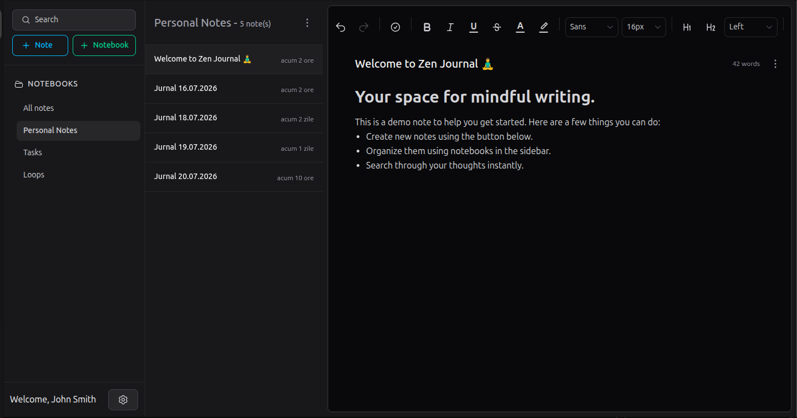
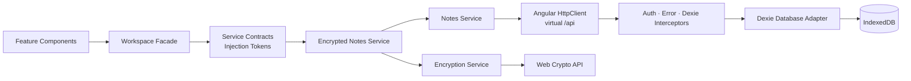
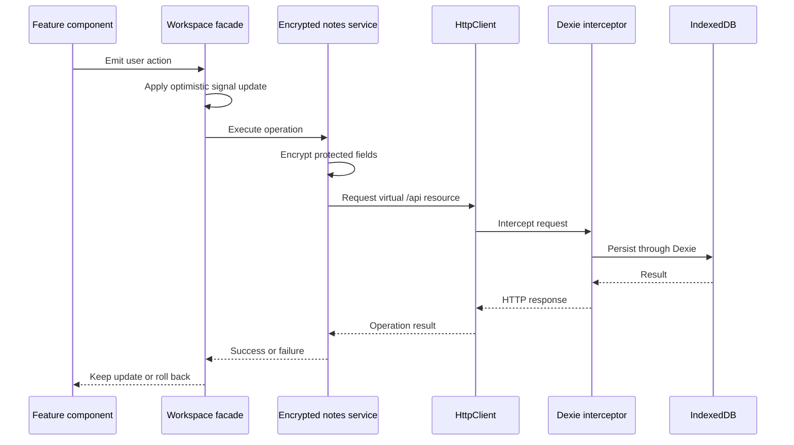
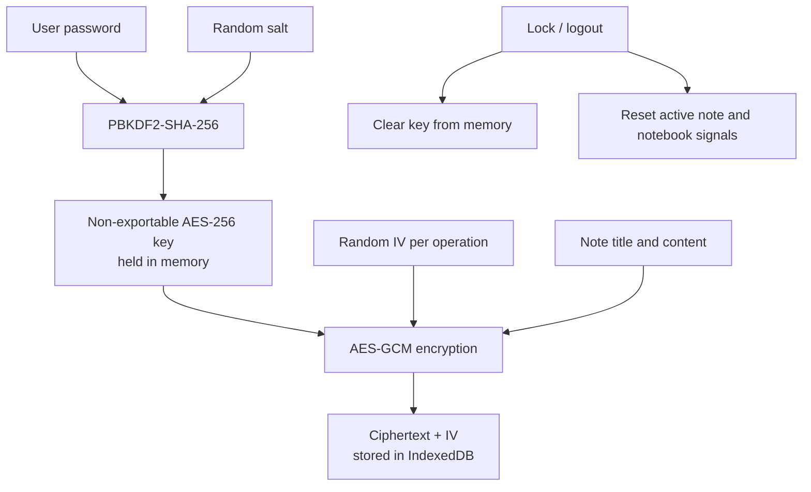

<div align="center">

# ZenJournal

### A privacy-first, offline journal built with modern Angular architecture

A responsive, installable note-taking workspace that keeps journal data in the browser, encrypts protected content before persistence, and demonstrates production-oriented frontend design patterns.

[Live Demo](https://epictetus-from-hierapolis.github.io/zen-journal/) · [Source Code](https://github.com/epictetus-from-hierapolis/zen-journal)


</div>



---

## Overview

ZenJournal is a minimalist, offline-first journal application built as a frontend engineering portfolio project.

The application combines a focused writing experience with a deliberately decoupled architecture:

- journal data is stored locally in IndexedDB through Dexie;
- protected note titles and content are encrypted with the Web Crypto API;
- Angular Signals provide explicit, read-only application state;
- a facade coordinates feature operations and optimistic updates;
- storage is accessed through a virtual HTTP boundary rather than directly from UI code;
- standalone, lazy-loaded features keep the application modular;
- the production build can be installed as a Progressive Web App.

The project demonstrates more than CRUD functionality. It explores how security, state management, dependency inversion, offline persistence, rich-text editing, and replaceable infrastructure can coexist in a maintainable Angular application.

## Live Demo

**Application:** [Open ZenJournal](https://epictetus-from-hierapolis.github.io/zen-journal/)

The hosted version runs entirely in the browser and can be installed as a PWA from supported browsers.

> Journal data belongs to the browser profile and device on which it is created. Clearing the site's browser storage removes the local database.

---

## Core Features

### Writing experience

- Rich-text editing powered by TipTap
- Headings, ordered and unordered lists
- Interactive task lists
- Text alignment and indentation
- Font family and font size controls
- Underline and strikethrough
- Text color and highlighting
- Debounced, configurable autosave

### Organization and discovery

- Create, rename, and delete notebooks
- Transactional cascade deletion for notebook contents
- Create, edit, move, and delete notes
- Full-text search across notes
- Contextual result snippets with matched-text highlighting
- Relative timestamps and word-count presentation

### User experience

- Responsive desktop and mobile layouts
- Adaptive mobile navigation
- Persistent light and dark themes
- Optimistic updates with rollback on persistence failure
- Offline-first behavior
- Installable PWA production build

### Privacy and local security

- AES-256-GCM content encryption
- PBKDF2-SHA-256 password-based key derivation
- Random salt and initialization vectors generated by Web Crypto
- Non-exportable browser `CryptoKey`
- Verification canary for password validation
- Derived key retained only in application memory
- Explicit lock and state-reset flow on logout
- Active authentication state scoped to the current browser tab

---

## Architecture

ZenJournal follows a feature-oriented Angular architecture with explicit boundaries between presentation, application state, contracts, and infrastructure.



### Main data flow



### Application structure

```text
src/app/
├── core/
│   ├── guards/                 # Application access rules
│   ├── interceptors/           # Auth, errors and virtual Dexie backend
│   └── services/               # Database, encryption, settings and facade
│
├── features/
│   ├── auth/                   # Password setup and database unlocking
│   ├── notebooks/              # Notebook navigation and management
│   ├── notes/                  # List, editor and search experience
│   └── settings/               # Theme and autosave preferences
│
├── shared/
│   ├── components/             # Reusable stateless UI
│   ├── constants/              # Stable application constants
│   ├── decorators/             # Cross-cutting behavior
│   ├── editor/                 # TipTap configuration
│   ├── interfaces/             # Service contracts
│   ├── models/                 # Application models
│   ├── pipes/                  # Pure presentation transforms
│   ├── tokens/                 # Dependency injection tokens
│   └── validators/             # Form validation
│
├── app.config.ts               # Composition root
├── app.routes.ts               # Lazy route configuration
└── app.ts                      # Root gatekeeper component
```

---

## Key Engineering Decisions

### 1. Workspace Facade as the state boundary

`WorkspaceFacadeService` is the single orchestration point for notebook and note state.

It:

- owns private writable signals;
- exposes read-only signals to consumers;
- coordinates notes and notebooks services;
- derives filtered and selected state;
- applies optimistic changes;
- restores previous state when persistence fails;
- centralizes reset behavior during logout.

This keeps feature components focused on presentation and user interaction.

### 2. Smart orchestrator and stateless feature components

The notes workspace acts as the smart feature boundary. Child components receive state through signal inputs and communicate through outputs.

This creates a predictable, unidirectional flow:

```text
read-only state → component rendering → user event → facade action → updated state
```

Components can therefore be tested without database or service dependencies.

### 3. Dependency inversion through Angular tokens

Application services are registered against `InjectionToken` contracts in `app.config.ts`.

```text
component/facade
      ↓
interface contract + injection token
      ↓
selected implementation
```

The composition root currently maps the notes contract to `EncryptedNotesService`. An implementation can be replaced without changing its consumers.

### 4. Decorator-based encryption

`EncryptedNotesService` implements the same contract as the base notes service and wraps persistence operations with encryption and decryption.

This keeps cryptographic concerns outside:

- UI components;
- the workspace facade;
- the base data service;
- the Dexie interceptor;
- the database wrapper.

The design follows the Open/Closed Principle and Single Responsibility Principle while preserving a stable service interface.

### 5. Replaceable persistence through a virtual API

Features do not communicate with Dexie directly. Data services issue requests through Angular `HttpClient` to virtual `/api` resources.

`dexieBackendInterceptor` translates those requests into IndexedDB operations.

```text
feature → service → HttpClient → interceptor → Dexie → IndexedDB
```

This creates a backend-shaped boundary inside an offline application. A future remote API adapter can replace the local interceptor without requiring feature components to understand the persistence mechanism.

### 6. Encapsulated Signal state

Mutable state remains private and is exposed through `.asReadonly()` or derived `computed()` signals.

External consumers can observe state but cannot modify it directly. All mutations pass through facade operations, where validation, persistence, optimistic updates, and rollback can be handled consistently.

### 7. Zoneless and OnPush rendering

The application uses `provideZonelessChangeDetection()` and explicit reactive state rather than relying on Zone.js.

This results in:

- predictable state-driven rendering;
- reduced implicit change-detection work;
- clearer ownership of asynchronous updates;
- architecture aligned with modern Angular patterns.

### 8. Root gatekeeper for protected rendering

The root application component renders either the unlock experience or the routed workspace according to authentication and encryption state.

Protected features are not instantiated before the database is unlocked. This centralizes the transition between locked and active application states and avoids feature-level race conditions.

---

## Security Model



### Implemented protections

- Password-derived encryption key
- Authenticated AES-GCM encryption
- Random per-installation salt
- Random IV for each encryption operation
- Non-exportable key material
- Password verification through an encrypted canary
- No persistent storage of the derived encryption key
- Session authentication stored in `sessionStorage`
- Explicit in-memory state clearing during logout

### Security boundaries

ZenJournal protects locally persisted journal content, but a browser application cannot defend against a compromised operating system, malicious browser extensions, active developer tools, or code running in the same trusted origin.

The application is a portfolio implementation, not a substitute for an independently audited security product.

---

## Offline and PWA Design

The production build enables Angular's service worker and prefetches the application shell and static assets.

Combined with IndexedDB persistence, this allows the application to:

- load its installed application shell without a backend;
- read and update journal data locally;
- remain functional without network connectivity;
- be installed from the hosted web application.

No backend is required for the current feature set.

---

## Technology Stack

| Area | Technology |
|---|---|
| Framework | Angular 22.0 |
| Architecture | Standalone components, lazy routes, zoneless change detection |
| Language | TypeScript 6.0 in strict mode |
| State | Angular Signals and RxJS 7 |
| Rich-text editor | TipTap 3.27 |
| Styling | Tailwind CSS 4.1 |
| Local persistence | Dexie 4.4 over IndexedDB |
| Encryption | Web Crypto API, AES-256-GCM, PBKDF2-SHA-256 |
| HTTP abstraction | Angular HttpClient and functional interceptors |
| PWA | Angular Service Worker |
| Testing | Jest, jest-preset-angular and jsdom |
| Deployment | GitHub Pages |

---

## Getting Started

### Prerequisites

- Node.js compatible with Angular 22
- npm 10.x

### Installation

```bash
git clone https://github.com/epictetus-from-hierapolis/zen-journal.git
cd zen-journal
npm ci
```

### Development server

```bash
npm start
```

The development configuration uses HTTPS:

```text
https://localhost:4200
```

A browser warning may be displayed for the local development certificate.

### Tests

```bash
npm test
```

### Production build

```bash
npm run build
```

Build output is generated under:

```text
dist/zen-journal/browser
```

### GitHub Pages deployment

```bash
npm run dp:gh
```

The deployment script builds the application with the `/zen-journal/` base path and publishes the browser output through `angular-cli-ghpages`.

---

## Portfolio Highlights

The project demonstrates practical experience with:

- Angular standalone architecture
- zoneless change detection
- signal-based state encapsulation
- RxJS-driven debouncing
- facade-based orchestration
- dependency inversion and token-based DI
- smart/dumb component boundaries
- optimistic updates and rollback
- custom functional HTTP interceptors
- IndexedDB and transactional browser persistence
- client-side authenticated encryption
- rich-text editor integration
- responsive design and theming
- PWA configuration and GitHub Pages deployment
- strict TypeScript and unit testing

---

## Architectural Extension Path

The current application is intentionally local-first and has no remote backend.

The virtual API boundary and encrypted service contract were designed so that future synchronization could be introduced without coupling feature components to a specific transport or storage technology.

Potential future work, not currently implemented:

- encrypted multi-device synchronization;
- conflict detection and resolution;
- encrypted export and import;
- accessibility auditing and automated checks;
- continuous integration for tests and production builds.

---

## License

Distributed under the MIT License.
