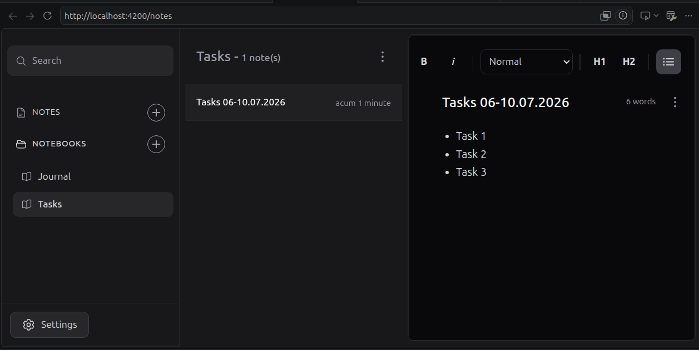

# ZenJournal

A minimalist, offline-first note-taking application built with Angular 22. Designed as a portfolio project to demonstrate modern Angular architecture patterns, reactive state management with Signals, and production-grade code organization.


 

---

## Features

- **Offline-first** — all data stored locally via [Dexie.js](https://dexie.org/) (IndexedDB), zero backend dependency
- **Zero-knowledge security** — local, transparent encryption using AES-256-GCM and PBKDF2 (Web Crypto API)
- **Rich text editing** — [TipTap](https://tiptap.dev/) integration with an advanced formatting toolbar supporting headings, bullet/numbered lists, custom interactive checklists (task lists), text alignment, block indentation, font family & size selectors, underline, strikethrough, text colors, and highlights (text backgrounds)
- **Notebook management** — create, rename, delete notebooks with cascade delete at database transaction level
- **Optimistic UI** — instant state updates with automatic rollback on failure
- **Debounced autosave** — content saved as you type, configurable delay
- **Real-time search** — full-text search across all notes with contextual snippet highlighting
- **Dark mode** — persisted theme preference
- **Responsive** — mobile sidebar with adaptive layout

---

## Architecture

### Folder Structure

```
src/app/
  ├── core/                        # Singleton infrastructure (bootstrapped once)
  │   ├── guards/                  # Route protection (auth guard)
  │   ├── interceptors/            # HTTP middleware (auth, error handling, Dexie backend)
  │   └── services/                # App-wide singletons: Auth, Database, Settings, Facade, Encryption
  │
  ├── features/                    # Feature modules (lazy-loaded)
  │   ├── auth/                    # Login flow and database unlocking (UnlockComponent)
  │   ├── notebooks/               # Notebook sidebar and creation
  │   ├── notes/                   # Note list, editor, search
  │   └── settings/                # App configuration
  │
  └── shared/                      # Reusable, stateless building blocks
    ├── components/              # Reusable dumb UI components (ModalComponent)
    ├── constants/               # App-wide constants (Storage keys)
    ├── decorators/              # Cross-cutting concerns (@HandleError)
    ├── editor/                  # Rich text editor configuration and presets
    ├── interfaces/              # Service contracts (INotesService, IWorkspaceFacadeService)
    ├── models/                  # Domain types (Note, Notebook, AppSettings)
    ├── pipes/                   # Pure transforms (relativeTime, wordCount, snippet)
    ├── tokens/                  # Injection tokens (decoupled DI)
    └── validators/              # Reactive form validators
```

### Key Architectural Decisions

**Workspace Facade Pattern**
`WorkspaceFacadeService` acts as the single source of truth for application state, orchestrating async operations across `NotesService` and `NotebooksService`. UI components are kept stateless — they read from signals and emit actions, never touching the database directly.

**Token-based Dependency Injection**
Services are provided via `InjectionToken` against interface contracts, not concrete classes. This enables full testability (swap any implementation at the token level) and was a deliberate choice over `providedIn: 'root'` to keep DI explicit.

**Dexie HTTP Interceptor**
All data operations go through Angular's `HttpClient` against a virtual `/api` endpoint. A custom `dexieBackendInterceptor` intercepts these requests and routes them to IndexedDB — meaning the entire data layer can be replaced with a real backend by removing one interceptor, with zero changes to services or components.

**Encapsulated Signal State**
State is held in private `WritableSignal` properties exposed as read-only `Signal` via `.asReadonly()`. External code can read signals but can never mutate state directly — all mutations go through facade methods with built-in optimistic update and rollback logic.

**Smart/Dumb Component Pattern**
Feature components (`NoteListComponent`, `NoteEditorComponent`, `NoteSearchComponent`, `NotebooksComponent`, `NotebookCreateComponent`) are fully dumb — they receive data exclusively via `input()` signals and communicate upward via `output()` events. `NotesComponent` acts as the single smart orchestrator: it injects the facade, passes data down, and handles all output events. This enforces a strict unidirectional data flow and makes every dumb component independently testable without any service dependencies.

**Zoneless Change Detection**
Uses `provideZonelessChangeDetection()` with `ChangeDetectionStrategy.OnPush` throughout, eliminating Zone.js overhead and making change detection fully explicit and predictable.

**Decorator Pattern for Encryption**
`EncryptedNotesService` wraps the base `NotesService` to intercept data operations transparently. It encrypts payloads before storage and decrypts them upon retrieval using the Web Crypto API (AES-GCM), all while strictly adhering to the `INotesService` contract. This keeps the database/interceptor layer completely unaware of cryptography, perfectly respecting the Single Responsibility Principle (SRP).

**Gatekeeper Pattern for Route Interception**
The root `App` component acts as the gatekeeper of the application, conditionally rendering either `<app-unlock>` or `<router-outlet />` based on the user's authentication and database unlock states. This centralized route interception guarantees that no feature components (such as notes or notebooks) are instantiated in the DOM before the local database is successfully decrypted, completely avoiding complex route guards or race conditions.

**Session Privacy & Memory Security**
Wiping local storage keys alone is insufficient for zero-knowledge privacy. On logout, the application explicitly triggers a "clean slate" sequence: navigating away to destroy active components, clearing the derived `CryptoKey` from memory via `lock()`, and purging all active notebooks/notes signals in `WorkspaceFacadeService` via `reset()`. This prevents any data recovery or visual leaks from RAM if another user accesses the browser session.

---

## Tech Stack

| Layer | Technology |
|---|---|
| Framework | Angular 22 (standalone, zoneless) |
| Language | TypeScript 5.9 (strict mode) |
| Reactivity | Angular Signals + RxJS 7 |
| Rich Text | TipTap 3.27 |
| Styling | Tailwind CSS 4 |
| Local Database | Dexie.js 4 (IndexedDB) |
| Testing | Jest + jsdom |

---

## Getting Started

```bash
# Install dependencies
npm install

# Start development server
npm start
# → http://localhost:4200

# Run tests
npm test

# Production build
npm run build
```

---

## License

MIT
